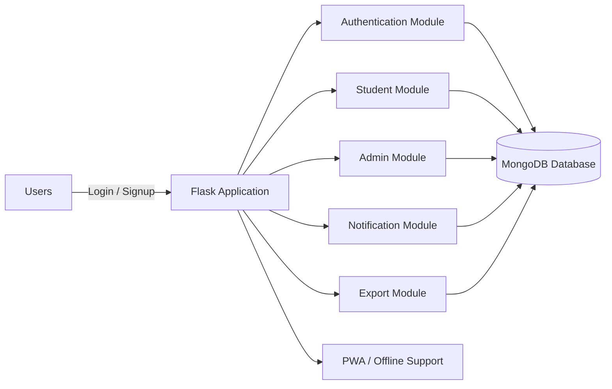
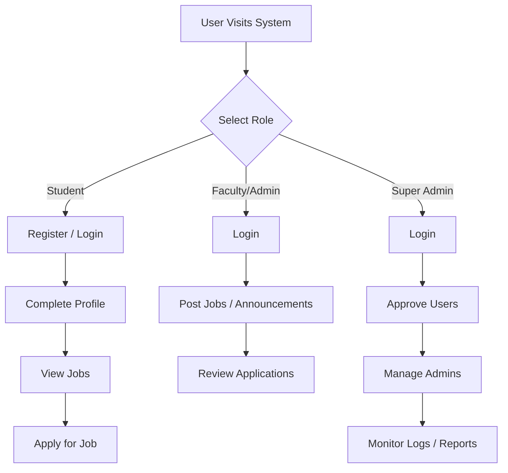
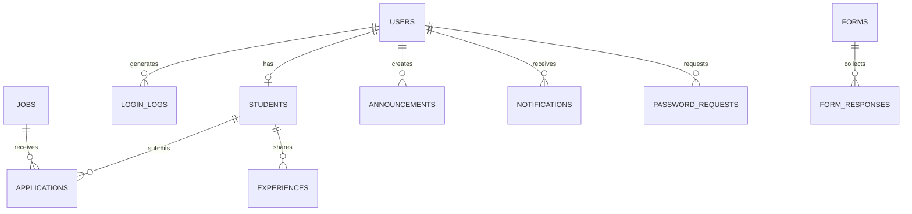

# Placement Cell Management System

## Final Project Report

**Project Title:** Placement Cell Management System  
**Project Type:** Web Application  
**Technology Stack:** Flask, MongoDB, HTML, CSS, JavaScript  
**Domain:** Educational Placement Management  

---

## Certificate

This is to certify that the project titled **Placement Cell Management System** has been completed successfully as part of the academic project work. The project has been developed to manage placement-related activities in an educational institution in a centralized, secure, and user-friendly manner.

---

## Declaration

I declare that this project report is the result of my own work, carried out under proper guidance and supervision. All the modules, features, and documentation included in this report are prepared for academic submission and project demonstration.

---

## Acknowledgement

I sincerely thank my guide, faculty members, and all the people who supported me during the development of this project. Their suggestions, encouragement, and practical feedback helped me improve the quality of the system and complete the work successfully. I also thank my classmates and friends for helping me test the application and review the presentation flow.

---

## Abstract

The Placement Cell Management System is a web-based application designed to simplify the placement process in colleges and educational institutions. It provides a single platform where students can register, complete profiles, upload resumes, view job openings, and apply for opportunities. At the same time, faculty members and administrators can post jobs, publish announcements, monitor student activity, approve registrations, and generate reports.

The system is built using Flask for the backend and MongoDB for data storage. It includes role-based access control, notification handling, login tracking, export generation, offline support, and responsive design for mobile and desktop use. The project reduces manual effort, improves communication, and makes placement operations more efficient and organized.

---

## Table of Contents

1. Introduction  
2. Problem Statement  
3. Objectives of the Project  
4. Scope of the Project  
5. Existing System  
6. Proposed System  
7. System Requirements  
8. System Analysis  
9. System Design and Architecture  
10. Database Design  
11. Module Description  
12. Implementation Details  
13. Security Features  
14. Testing and Validation  
15. Advantages and Limitations  
16. Future Enhancements  
17. Conclusion  
18. Presentation Guide  

---

## Chapter 1: Introduction

Placement activities are a very important part of academic institutions because they connect students with companies and career opportunities. A smooth placement process helps students get job access on time and helps the institution maintain proper records. However, in many colleges, placement management is still handled through manual registers, spreadsheets, emails, and disconnected communication channels. This often creates confusion, data duplication, and delays.

The Placement Cell Management System is designed to solve these issues by bringing all placement-related operations into one web application. The system allows student registration, profile completion, resume upload, job posting, announcement publishing, application tracking, admin approvals, and report generation. It also provides notifications and access control so that each type of user sees only the features relevant to them.

The project follows a practical approach and is designed with real institutional use in mind. It focuses on user convenience, system security, maintainability, and responsiveness so that it can work efficiently across different devices.

---

## Chapter 2: Problem Statement

The traditional placement process has several problems. Student records are often stored in separate files, job updates are sent through informal channels, and approval processes are handled manually. As a result, students may not receive timely information, administrators may lose track of applications, and faculty members may spend extra time collecting and verifying data.

Some common issues in the existing process are:

- Delay in sharing job notifications
- Manual approval of student registrations
- Difficulty in monitoring student activity
- No centralized record of applications and announcements
- Poor coordination between admins, faculty, and students
- Repeated data entry in multiple places
- Limited reporting and export facilities

These limitations show the need for a digital and centralized placement management system that can improve speed, accuracy, and control.

---

## Chapter 3: Objectives of the Project

The main objectives of this project are:

- To develop a centralized web-based placement management platform.
- To support three user roles: Super Admin, Faculty/Admin, and Student.
- To automate registration, approval, and login workflows.
- To allow students to complete profiles and upload resumes.
- To let faculty/admins post jobs and announcements efficiently.
- To provide students with job browsing and application features.
- To store and manage data securely in a database.
- To maintain login history and activity tracking.
- To generate exportable reports for administrators.
- To support mobile-friendly and offline-capable usage.

The project aims to simplify the placement process while also improving transparency and user experience.

---

## Chapter 4: Scope of the Project

The scope of the project covers the main activities of a placement cell in an educational institution. It includes student onboarding, academic profile storage, resume handling, job posting, announcement management, student applications, admin approvals, and reporting. The system is useful for colleges, universities, and training institutions that conduct placement drives for students.

The system can be used by:

- Students who want to apply for placement opportunities
- Faculty members who manage training and recruitment announcements
- Super admins who control approvals, permissions, and monitoring

The project also has room for future expansion. It can later be extended to include recruiter login, interview scheduling, offer tracking, email alerts, SMS alerts, and advanced analytics.

---

## Chapter 5: Existing System

In the existing manual or semi-digital process, placement-related data is often handled through paper forms, spreadsheets, and scattered communication tools. This makes it harder to manage registration, verify eligibility, track applications, and communicate important updates. Because the data is not centralized, mistakes can happen easily and records may not remain consistent.

The existing system usually suffers from the following drawbacks:

- Time-consuming data collection
- Lack of proper access control
- No automatic notifications
- Difficulty in managing large student groups
- No central dashboard for monitoring
- Poor visibility of application status
- No easy export or reporting mechanism

These limitations motivated the development of a more efficient and organized placement system.

---

## Chapter 6: Proposed System

The proposed system is a Flask-based placement cell management application connected to MongoDB. It acts as a centralized platform where users can perform their role-specific tasks securely. Students can register, complete academic details, upload resumes, view jobs, and apply online. Faculty and admins can create and publish jobs, manage announcements, review applications, and export data. Super admins can approve users, manage other admins, and monitor the entire system.

This system improves the placement workflow in several ways:

- It reduces manual effort through automation.
- It improves communication through notifications.
- It stores records in a structured database.
- It uses role-based access for safety.
- It supports mobile and offline usage.
- It provides detailed login and activity tracking.

The proposed system is practical, scalable, and suitable for real-world deployment in an academic environment.

---

## Chapter 7: System Requirements

### Hardware Requirements

- A desktop or laptop computer
- At least 4 GB RAM
- Minimum dual-core processor
- Stable internet connection
- Modern web browser

### Software Requirements

- Python 3.8 or above
- Flask framework
- MongoDB database
- HTML5, CSS3, JavaScript
- Werkzeug for security and file handling
- Supporting Python libraries from `requirements.txt`

---

## Chapter 8: System Analysis

System analysis helps identify how the project should work, what the users need, and how the modules should interact. In this project, the main users are students, faculty/admins, and super admins. Each of these roles has different goals and permissions. Students need access to jobs and profile management. Faculty members need tools for posting opportunities and announcements. Super admins need complete oversight and approval control.

From an operational point of view, the system must be:

- Easy to use
- Secure
- Fast to respond
- Able to store large amounts of data
- Accessible from different screen sizes
- Capable of producing reports and notifications

The analysis phase shows that a centralized web system is the best solution for the placement workflow because it can handle multiple users and keep all records in one place.

---

## Chapter 9: System Design and Architecture

The system follows a client-server architecture. The frontend handles the display of pages, forms, cards, tables, and navigation. The backend is implemented using Flask, which processes routes, user sessions, permission checks, and database actions. MongoDB stores all data, including users, students, jobs, applications, notifications, forms, and login logs.

The architecture can be divided into the following parts:

### 9.1 Presentation Layer

This layer includes the HTML templates, CSS styling, and JavaScript interactions. It is responsible for the visual appearance and user experience of the application.

### 9.2 Application Layer

This layer contains the Flask routes, business rules, authentication logic, notification generation, export functions, and workflow processing.

### 9.3 Data Layer

This layer contains MongoDB collections and GridFS-based file storage for resume and uploaded files.

### 9.4 Support Layer

This layer includes login tracking, PWA support, offline page handling, and notification polling.

The modular design makes the project easy to maintain, debug, and extend.

### 9.5 System Architecture Diagram

### 9.6 User Role Flow Diagram

### 9.7 Database Relationship Diagram

---

## Chapter 10: Database Design

The project uses MongoDB collections to organize different types of data. Each collection is designed for a specific purpose.

### Main Collections

- `users` for login and role information
- `students` for student profile and academic data
- `jobs` for placement job records
- `applications` for applications submitted by students
- `announcements` for placement notices and updates
- `experiences` for sharing placement experiences
- `notifications` for user alerts
- `login_logs` for login timestamps and IP data
- `forms` for dynamic forms created by admins
- `form_responses` for student responses to forms
- `password_requests` for password reset requests

### Database Strengths

- Flexible schema design
- Easy addition of new fields
- Good support for nested academic records
- Suitable for rapid development
- Easy integration with Flask

The database structure supports all major system workflows without making the application overly complex.

---

## Chapter 11: Module Description

### 11.1 Authentication Module

This module manages login, signup, password hashing, and role verification. Students and admins log in using their email and password. The system checks whether the user role matches the selected role before allowing access. It also ensures that approved access rules are enforced for students and admins.

### 11.2 Student Registration and Profile Module

Students can register with their details and then complete their profile. During profile completion, the system stores academic history, skills, projects, and resume data. Resume files are uploaded securely and linked to the student account.

### 11.3 Job Management Module

Admins and faculty can create job postings with company details, role, eligibility criteria, package, dates, description, and status. Jobs can be saved as draft or published directly. When a job is published, notifications are sent to eligible students.

### 11.4 Announcement Module

This module lets admins publish notices for students. Announcements can have categories, priority levels, and scheduled visibility. Published announcements are shown to students and can also trigger notifications.

### 11.5 Application Module

Students can apply to jobs directly through the portal. The system stores the application date, status, and any student response. Admins can view applications, update status, and export data.

### 11.6 Notification Module

Notifications are created for many events such as student approval, job publishing, admin approval, announcements, and custom messages. The notification system displays unread counts and recent alerts to the user.

### 11.7 Login Monitoring Module

The system stores login history with time and IP address. Super admins can view login logs and student activity records to monitor system usage and engagement.

### 11.8 Export and Reporting Module

The export module generates CSV files for student and application data. This makes it easier to share records with companies, committees, and placement coordinators.

### 11.9 Dynamic Forms Module

The system includes dynamic form support so admins can create custom forms, collect responses from students, and export the data later. This is useful for collecting information for drives, consent, or additional student details.

### 11.10 Offline and PWA Module

The application includes offline support through a service worker and offline page. This allows essential pages and notifications to remain accessible even when the internet connection is unstable.

---

## Chapter 12: Implementation Details

The backend application is developed using Flask. The routes handle login, signup, dashboards, student profile completion, job actions, announcement actions, notifications, exports, and admin operations. The `login_required` decorator ensures that users cannot access pages without proper authentication.

The implementation includes:

- Secure password hashing
- Session-based login management
- Role-based route protection
- MongoDB document operations
- GridFS support for file storage
- CSV export generation
- Notification creation and polling
- Offline support and PWA behavior

The frontend is built with templates and responsive styles. The pages are designed to display important information clearly through cards, tables, dashboards, and action buttons.

### Example Workflow

1. A student registers and completes a profile.
2. The student uploads a resume.
3. An admin approves the student.
4. A faculty member posts a job.
5. Eligible students receive notifications.
6. Students apply through the portal.
7. Admins review applications and export reports.

This workflow shows how the system supports the full placement cycle.

---

## Chapter 13: Security Features

Security is a major concern in this project because the system stores personal and academic information. Several security measures are used to protect the application.

### Security Controls

- Passwords are hashed instead of stored in plain text
- Role-based access control prevents unauthorized access
- CSRF protection helps block forged requests
- Login rate limiting reduces brute-force attempts
- Secure session settings improve session safety
- Secure headers help reduce common web risks
- Login history helps detect suspicious activity

These measures make the system more reliable and suitable for institutional use.

---

## Chapter 14: Testing and Validation

Testing is required to verify that each module works correctly. The project should be tested for registration, login, role access, profile completion, job posting, job publishing, job application, announcement posting, notifications, exports, and offline mode.

### Functional Testing

- Login with valid and invalid credentials
- Student registration and approval
- Resume upload and profile update
- Job posting and job publication
- Job application submission
- Announcement creation and display
- Notification generation and read status
- Export of student and application data

### Responsive Testing

The interface should be tested on:

- Mobile phones
- Small tablets
- Large tablets
- Desktop screens

### Security Testing

- Verify session restrictions
- Check role-based access
- Confirm password protection
- Validate CSRF controls
- Test login rate limiting

### Offline Testing

- Check offline page loading
- Verify cached resources
- Test notification sync behavior

Testing confirms that the application is stable, usable, and ready for deployment.

---

## Chapter 15: Advantages of the Project

This project offers many practical advantages:

- It reduces manual work in the placement cell.
- It stores all placement data in one place.
- It improves communication between users.
- It saves time for administrators and faculty.
- It allows students to access opportunities quickly.
- It provides a secure and structured workflow.
- It can be used on mobile and desktop devices.
- It supports future expansion and feature additions.

The system is efficient, organized, and suitable for modern academic environments.

---

## Chapter 16: Limitations

Although the project is highly useful, it still has some limitations:

- Internet access is required for most live operations.
- Recruiter-side login is not yet included.
- Advanced analytics can still be improved.
- SMS and email integration is not fully built.
- Interview scheduling and offer tracking are future improvements.

These limitations do not reduce the usefulness of the current system, but they show where future versions can be improved.

---

## Chapter 17: Future Enhancements

The project can be extended in many ways:

- Recruiter portal for companies
- Email and SMS notifications
- Interview scheduling system
- Offer letter and placement tracking
- Advanced analytics dashboard
- AI-based job recommendation
- Alumni networking module
- Better document preview support
- Cloud storage integration
- Multi-institution support

These features would make the system even stronger and more useful in the future.

---

## Chapter 18: Conclusion

The Placement Cell Management System is a complete web-based solution for managing placement activities in an educational institution. It brings together registration, profile completion, job management, announcements, notifications, application tracking, reporting, and login monitoring in one centralized platform.

The system reduces manual work, improves communication, increases transparency, and provides a better experience for both students and administrators. With secure authentication, responsive design, offline support, and modular architecture, the project is suitable for real academic deployment. It demonstrates how modern web technologies can simplify and improve placement management.

---

## How to Present This Project

If you are presenting this project in viva, seminar, or internal review, follow this flow:

1. Start with the project title and your introduction.
2. Explain why the project was needed.
3. Describe the problem in the existing system.
4. Present the objectives and scope.
5. Explain the technology stack.
6. Show the system architecture.
7. Explain the user roles.
8. Describe the main modules one by one.
9. Discuss the database design.
10. Highlight security features.
11. Mention testing and validation.
12. End with advantages, limitations, future scope, and conclusion.

### Simple Presentation Script

You can say:

“My project is the Placement Cell Management System. It is a Flask and MongoDB based web application created to manage placement activities in an educational institution. The system supports three user roles: super admin, faculty/admin, and student. Students can register, complete profiles, upload resumes, view jobs, and apply for placements. Faculty and admins can post jobs and announcements, while super admins can approve users and manage the system. The application also includes notifications, exports, login tracking, offline support, and responsive design. Overall, this project makes the placement process more organized, secure, and efficient.”

### Short Viva Answer Version

If the examiner asks for a short summary, you can say:

“This project is a centralized placement management system developed using Flask and MongoDB. It helps manage student registration, job posting, announcements, applications, notifications, and reports in one platform.”

---

## Final Summary

This report is a full project document with detailed chapters, implementation notes, testing points, advantages, limitations, future scope, and presentation guidance. It is suitable for college submission, viva preparation, and project demonstration.
